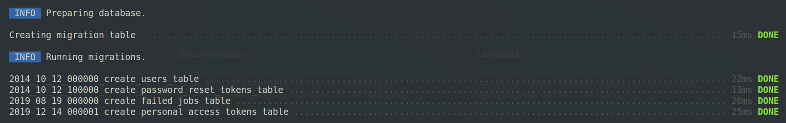
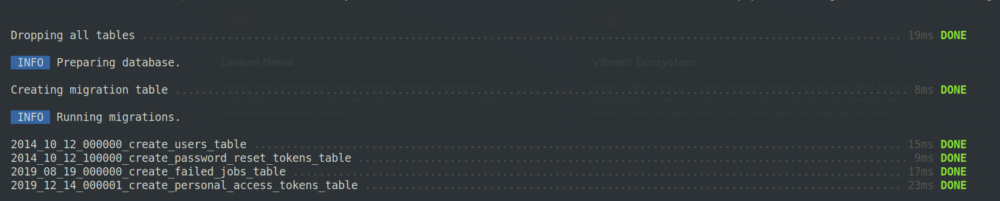
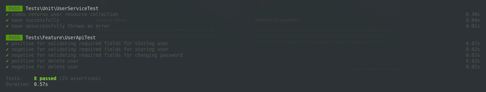
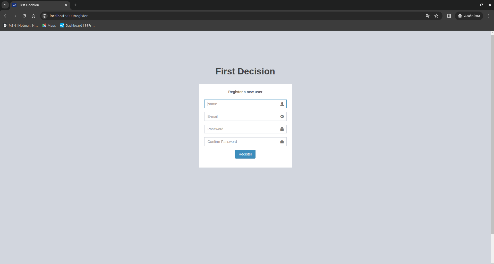
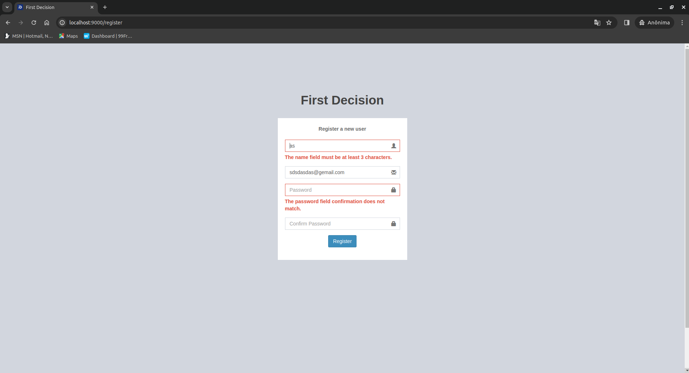
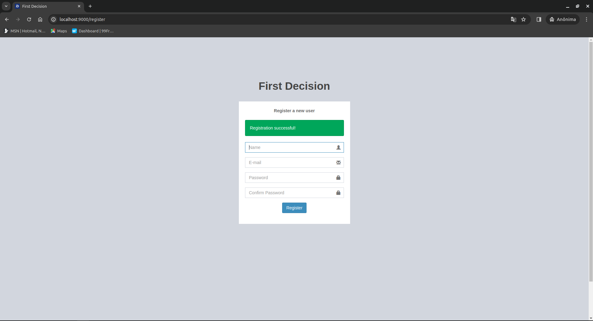

## About
First Decision test. This project is a web application that utilizes the Laravel framework on the back-end and a PostgreSQL database for data storage.

## Objectives
### User Registration with PHP, Laravel, and PostgreSQL
The focus of this project is to create a user registration functionality with the following requirements:

### Registration Page (Laravel/Blade):
Create a user registration page with the following fields:

- Name (required, minimum 3 characters, maximum 50 characters).
- Email (required, must be a valid email address).
- Password (required, minimum 6 characters, maximum 20 characters).
- Confirm Password (required and must match the password).

### Validations (Laravel):
- Use the validation tools provided by Laravel to validate the form fields.
- Display appropriate error messages when fields do not meet the specified rules above.

### Model and Migration (Laravel):
- Create a model and migration to store users in the PostgreSQL database.
- Configure the table to store user information.

### Back-end API (Laravel):
- Create a RESTful API in Laravel to process user registration.
- Validate data received from the request, including password confirmation.
- Store registered users in the PostgreSQL database.
- Return an appropriate response to the front-end (e.g., success or error) in JSON format.

### Unit Tests (Laravel/PHP):
- Write at least one unit test for the Laravel API to ensure data is validated correctly and stored in the PostgreSQL database.
- Use the Laravel testing tool for this purpose.

### Error Handling (Laravel):
- Implement appropriate error handling in the Laravel API to handle communication failures with the front-end.
- Return error responses in JSON format.

## Solution

Made using the Laravel 10 framework, PostgreSQL, Nginx, SQLite for tests and
Docker for application containerization.

## How to run the project

After downloading the **first** repository, being in its main folder, go up the structure composed of the following containers:

- **first-back:** Composed with nginx and PHP, being exposed to port `9000`;
- **first-db:** With the PostgreSQL database.

1) Through the following commands:
```sh 
docker-compose build
```
```sh 
docker-compose up -d
```

After finishing the creation of the containers, we must execute the commands below so that the environment is ready to be used:

1. Used to create tables of the solution:
   ```sh 
   docker exec -it first-back php artisan migrate
   ```
   
2. 
3. Used to create tables in SQLite to be used in the tests:
    ```sh
    docker exec -it first-back php artisan migrate:fresh --env=testing
    ```
   
4. 
5. To execute the tests, use the command below:
    ```sh
    docker exec -it first-back php artisan test --env=testing
    ```
Some tests were created as an example:



Now we can use the application through the address "http://127.0.0.1:9000/register" to register a user.
For this simple screen, a View with Blade was used according to the requirements of the test. It is worth highlighting the customization of the icon and description of the tab, it turned out well, didn't it?



In this second example, we can observer the validations in action:



After inputting all the data correctly, we will have a confirmation message as shown in the image below:



To conclude, we can access the address "http://localhost:9000/request-docs/" where we can visualize and test all user endpoints.
NOTE: If you are on the user registration page, you can directly access the above address by clicking "First Decision".
